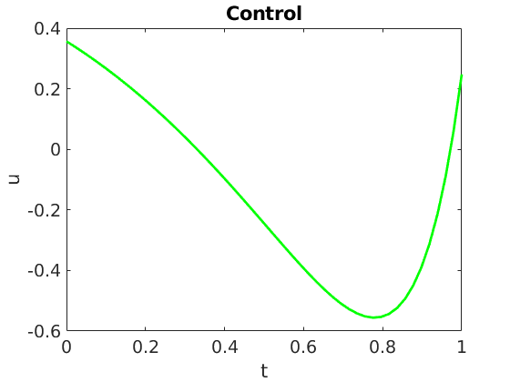
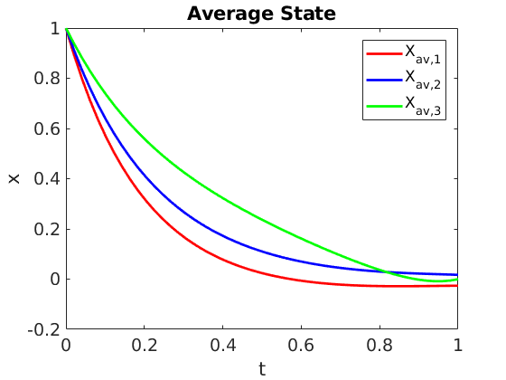
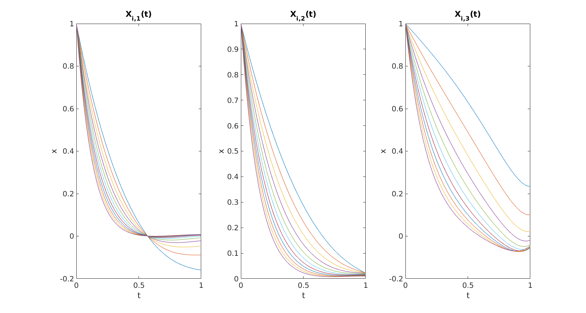

# Averaged Control

In this work, we address the optimal control of parameter-dependent systems. We introduce the notion of averaged control in which the quantity of interest is the average of the states with respect to the parameter family .

<p align="center">
  
</p>

with  the space of admissible controls and  the average state target. The optimization problem is subject to the finite dimensional linear control system

<p align="center">
    
</p>

## Steepest Descent Method

We use the classical gradient descent method based on the adjoint methodology, and obtain the corresponding adjoint system,

<p align="center">
    
</p>

The functional is minimized by taking the steepest descent direction given by

<p align="center">
    
</p>

and the new control reads as

<p align="center">
    
</p>

for some  small enough.

## Conjugate Gradient Method

We have also used the conjugate gradient method in order to reach faster the optimal control. In order to be able to apply this method the state vector has been split as

<p align="center">
    
</p>

where  is the solution to the controlled system with zero initial condition,

<p align="center">
    
</p>

and  solves the free dynamics problem,

<p align="center">
    
</p>

The functional can be expressed as

<p align="center">
    
</p>

We introduce the linear operator

<p align="center">
    
</p>

and its dual counterpart,

<p align="center">
    
</p>

where  is solution to

<p align="center">
    
</p>

By doing this we can write the directional derivative of the functional as

<p align="center">
    
</p>

After having defined  and  we can apply the conjugate gradient method to solve the control problem.


## Running the example

Both steepest descent and conjugate gradient methods have been implemented in Matlab. The can be run by typing in the Command Window

* for the steepest descent method:
```Matlab
AveragedControlSD
```

* for the conjugate gradient method:
```Matlab
AveragedControlCG
```

<p align="center">
  
</p>

<p align="center">
  
</p>

<p align="center">
  
</p>

## References

* E. Zuazua (2014). Averaged Control. _Automatica_, 50 (12), p. 3077-3087.
